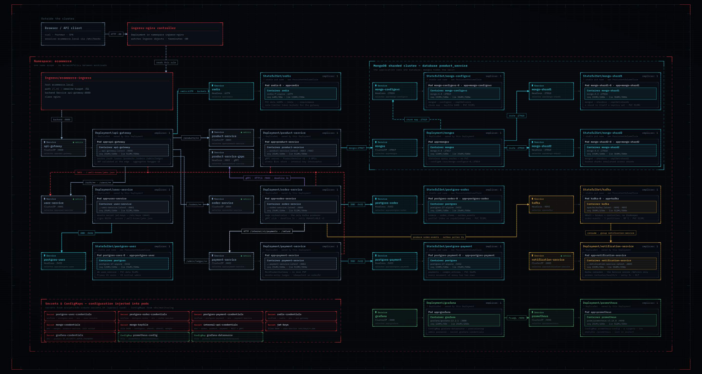

<div align="center">

# ecommerce-platform

**Scalable E-Commerce Microservices**


[](https://github.com/ShilovVyacheslav/ecommerce-platform/actions/workflows/ci.yml)


</div>

---

<p align="center">
  
</p>

---

## | Highlights

- **API Documentation** — aggregated OpenAPI 3 / Swagger UI for all services behind the gateway
- **JWT Auth** — RS256, validated independently by every service via JWKS, no shared secret
- **Saga Pattern** — order-service orchestrates order/payment/product with compensating actions on failure
- **gRPC** — contract-first internal order-service ↔ product-service communication
- **Outbox + Kafka** — transactional outbox, dead-letter topic with retry on consume
- **Rate Limiting** — Redis-backed distributed rate limiter at the API gateway
- **Ledger** — double-entry accounting in payment-service, balanced debit/credit entries
- **Prometheus + Grafana** — metrics across all services, including custom business metrics
- **Kubernetes** — full manifests, StatefulSets for Mongo/Kafka/Postgres, Ingress, scripted secrets

---

## | Getting Started

**API Documentation: [http://localhost:8080/swagger-ui.html](http://localhost:8080/swagger-ui.html)**

**Default Admin Account**

- Username: `admin`
- Password: `Admin#23`

**Clone the repository:**
```bash
git clone https://github.com/ShilovVyacheslav/ecommerce-platform.git
cd ecommerce-platform
```

---

<details>
<summary><b>Option 1: Docker (recommended)</b></summary>

<br>

### Option 1: Docker (recommended)

**First-time setup:**

<table>
<colgroup><col style="width: 50%"><col style="width: 50%"></colgroup>
<tr><th>bash / zsh / sh</th><th>PowerShell</th></tr>
<tr><td>

```bash
cp .env.example .env.docker
```

</td><td>

```bash
Copy-Item .env.example .env.docker
```

</td></tr>
</table>

If you have a fast machine and stable resources, a single command is enough:
```bash
docker compose --env-file .env.docker up --build -d
```

**If that struggles** — Docker Desktop can choke trying to build six JVM images and start 10+ containers all at once, especially on constrained CPU/network. Bring the stack up in stages instead:

```bash
# 1. Infrastructure first
docker compose --env-file .env.docker up -d postgres-user postgres-payment \
  postgres-order mongo-product redis kafka discovery-server prometheus grafana

# 2. Build each service image one by one
docker compose --env-file .env.docker build user-service
docker compose --env-file .env.docker build payment-service
docker compose --env-file .env.docker build product-service
docker compose --env-file .env.docker build order-service
docker compose --env-file .env.docker build api-gateway
docker compose --env-file .env.docker build notification-service

# 3. Start services in dependency order
docker compose --env-file .env.docker up -d user-service
docker compose --env-file .env.docker up -d payment-service
docker compose --env-file .env.docker up -d product-service
docker compose --env-file .env.docker up -d order-service
docker compose --env-file .env.docker up -d api-gateway
docker compose --env-file .env.docker up -d notification-service
```

**Monitoring** 
- Prometheus: http://localhost:9090
- Grafana: http://localhost:3000 (`admin` / `GRAFANA_ADMIN_PASSWORD` from `.env.docker`)

**Shut down:**

```bash
docker compose --env-file .env.docker down
```

</details>

---

<details>
<summary><b>Option 2: Manual</b></summary>

<br>

### Option 2: Manual

Requires locally running:
- **PostgreSQL** — one instance, database named `ecommerce-platform`, `postgres`/`postgres` credentials, or update `application-local.yml` in each service to match your own;
- **MongoDB** — one instance, no auth required for the `local` profile;
- **Redis** — one instance, no auth required for the `local` profile;

**Generate a local JWT keypair:**

<table>
<colgroup><col style="width: 50%"><col style="width: 50%"></colgroup>
<tr><th>bash / zsh / sh</th><th>PowerShell</th></tr>
<tr><td>

```bash
./scripts/generate-jwt-keys.sh
```

</td><td>

```bash
.\scripts\generate-jwt-keys.ps1
```

</td></tr>
</table>

**Terminal 1 — redis**:

<table>
<colgroup><col style="width: 50%"><col style="width: 50%"></colgroup>
<tr><th>bash / zsh / sh</th><th>PowerShell</th></tr>
<tr><td>

```bash
# macOS
brew services start redis
```
```bash
redis-server
```

</td><td>

```bash
cd C:\Path\To\Redis
.\redis-server.exe
```

</td></tr>
</table>

**Terminal 2 — discovery-server**:

<table>
<tr><td><strong>bash / zsh / sh</strong></td>
<td>

```bash
./gradlew :discovery-server:bootRun
```

</td></tr>
<tr><td><strong>PowerShell / cmd</strong></td>
<td>

```bash
.\gradlew.bat :discovery-server:bootRun
```

</td></tr>
</table>

**Terminal 3 — user-service:**

<table>
<tr><td><strong>bash / zsh / sh</strong></td>
<td>

```bash
./gradlew :user-service:bootRun --args='--spring.profiles.active=local'
```

</td></tr>
<tr><td><strong>PowerShell / cmd</strong></td>
<td>

```bash
.\gradlew.bat :user-service:bootRun --args='--spring.profiles.active=local'
```

</td></tr>
</table>

**Terminal 4 — payment-service:**

<table>
<tr><td><strong>bash / zsh / sh</strong></td>
<td>

```bash
./gradlew :payment-service:bootRun --args='--spring.profiles.active=local'
```

</td></tr>
<tr><td><strong>PowerShell / cmd</strong></td>
<td>

```bash
.\gradlew.bat :payment-service:bootRun --args='--spring.profiles.active=local'
```

</td></tr>
</table>

**Terminal 5 — product-service:**

<table>
<tr><td><strong>bash / zsh / sh</strong></td>
<td>

```bash
./gradlew :product-service:bootRun --args='--spring.profiles.active=local'
```

</td></tr>
<tr><td><strong>PowerShell / cmd</strong></td>
<td>

```bash
.\gradlew.bat :product-service:bootRun --args='--spring.profiles.active=local'
```

</td></tr>
</table>

**Terminal 6 — order-service:**

<table>
<tr><td><strong>bash / zsh / sh</strong></td>
<td>

```bash
./gradlew :order-service:bootRun --args='--spring.profiles.active=local'
```

</td></tr>
<tr><td><strong>PowerShell / cmd</strong></td>
<td>

```bash
.\gradlew.bat :order-service:bootRun --args='--spring.profiles.active=local'
```

</td></tr>
</table>

**Terminal 7 — notification-service:**

<table>
<tr><td><strong>bash / zsh / sh</strong></td>
<td>

```bash
./gradlew :notification-service:bootRun --args='--spring.profiles.active=local'
```

</td></tr>
<tr><td><strong>PowerShell / cmd</strong></td>
<td>

```bash
.\gradlew.bat :notification-service:bootRun --args='--spring.profiles.active=local'
```

</td></tr>
</table>

**Terminal 8 — api-gateway** (start last — it resolves `lb://` against the other five):

<table>
<tr><td><strong>bash / zsh / sh</strong></td>
<td>

```bash
./gradlew :api-gateway:bootRun --args='--spring.profiles.active=local'
```

</td></tr>
<tr><td><strong>PowerShell / cmd</strong></td>
<td>

```bash
.\gradlew.bat :api-gateway:bootRun --args='--spring.profiles.active=local'
```

</td></tr>
</table>

</details>

---

<details>
<summary><b>Option 3: Kubernetes</b></summary>

<br>

### Option 3: Kubernetes

**Start the cluster:**
```bash
minikube start --driver=docker --cpus=8 --memory=8192
minikube addons enable ingress
```

**Build the images into minikube's own Docker daemon**:

```bash
cp .env.example .env.docker
eval $(minikube docker-env)
DOCKER_BUILDKIT=0 COMPOSE_DOCKER_CLI_BUILD=0 docker compose --env-file .env.docker build user-service payment-service product-service order-service api-gateway notification-service
```

**Namespace and secrets:**
```bash
kubectl apply -f k8s/00-namespace.yaml
chmod +x ./scripts/k8s-create-secrets.sh ./scripts/generate-jwt-keys.sh
./scripts/k8s-create-secrets.sh
```

**Bring up the infrastructure, waiting on each layer before the next:**
```bash
kubectl apply -f k8s/databases/
kubectl wait --for=condition=ready pod -l app=postgres-user -n ecommerce --timeout=120s
kubectl wait --for=condition=ready pod -l app=postgres-payment -n ecommerce --timeout=120s
kubectl wait --for=condition=ready pod -l app=postgres-order -n ecommerce --timeout=120s

kubectl apply -f k8s/cache/
kubectl wait --for=condition=ready pod -l app=redis -n ecommerce --timeout=120s

kubectl apply -f k8s/messaging/
kubectl wait --for=condition=ready pod -l app=kafka -n ecommerce --timeout=120s
```

**MongoDB sharded cluster — must come up in order:**
```bash
kubectl apply -f k8s/mongodb-cluster/mongo-configsvr.yaml
kubectl wait --for=condition=ready pod -l app=mongo-configsvr -n ecommerce --timeout=180s

kubectl apply -f k8s/mongodb-cluster/mongo-shard1.yaml -f k8s/mongodb-cluster/mongo-shard2.yaml
kubectl wait --for=condition=ready pod -l app=mongo-shard1 -n ecommerce --timeout=180s
kubectl wait --for=condition=ready pod -l app=mongo-shard2 -n ecommerce --timeout=180s

kubectl apply -f k8s/mongodb-cluster/mongo-mongos.yaml
kubectl wait --for=condition=ready pod -l app=mongos -n ecommerce --timeout=180s

chmod +x scripts/k8s-init-mongo-cluster.sh
./scripts/k8s-init-mongo-cluster.sh
```

**Business services:**
```bash
kubectl apply -f k8s/services/user-service.yaml
kubectl wait --for=condition=ready pod -l app=user-service -n ecommerce --timeout=180s

kubectl apply -f k8s/services/
kubectl get pods -n ecommerce -w

kubectl apply -f k8s/monitoring/
kubectl wait --for=condition=ready pod -l app=prometheus -n ecommerce --timeout=120s
kubectl wait --for=condition=ready pod -l app=grafana -n ecommerce --timeout=120s
```
Wait until everything shows `1/1 Running`, then `Ctrl+C`.

**Access the API:**
```bash
kubectl apply -f k8s/networking/
minikube service api-gateway -n ecommerce --url
```
That URL is a direct route to `api-gateway`, equivalent to `http://localhost:8080` in the other two options.


**Access monitoring:**
```bash
kubectl port-forward -n ecommerce svc/prometheus 9090:9090 &
kubectl port-forward -n ecommerce svc/grafana 3000:3000 &
```
- Prometheus — http://localhost:9090
- Grafana — http://localhost:3000 (`admin` / from `grafana-credentials`).

</details>

---